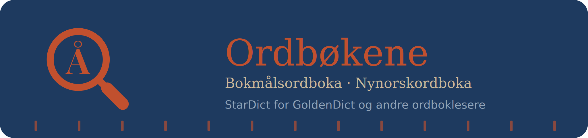

# ordboker-stardict

Automatisk genererte StarDict-ordbøker (`.ifo`/`.idx`/`.dict.dz`/`.syn`) av
Bokmålsordboka og Nynorskordboka fra [Ordbøkene.no](https://ordbokene.no),
bygget **månedlig** med GitHub Actions.

## Hvordan det henger sammen

Data hentes fra UiBs offisielle nedlastingsside for ordlister
(<https://ord.uib.no/ord_1_Ordlister.html>), *ikke* API-et
(<https://ord.uib.no/ord_2_API.html>). Grunnen:

- `article.tar.gz` inneholder **alle** artikler i ett steg (ett
  `article/<id>.json` per artikkel), og UiB oppgir selv at filen
  "oppdateres hver uke, natt til mandag" - mer enn hyppig nok for en
  månedlig jobb.
- API-et (`/api/suggest`, `/api/articles`, `/dict/article/{id}.json`) er
  laget for enkeltoppslag/autocomplete i en levende app. Å bygge en full
  ordbok via API-et ville krevd å iterere over titusenvis av artikkel-ID-er
  med separate HTTP-kall - unødvendig tregt og unødvendig belastende for
  UiBs servere når hele datasettet allerede ligger klart som fil.

All parsing av selve artikkelstrukturen (rekursiv tolkning av
definisjoner, eksempler, faste uttrykk/idiomer, bøyingsformer,
kryssreferanser) ligger i `scripts/ordbok_parser.py`. Dette gir samme
detaljnivå som selve ordbokene.no:

- **Bøyingstabell**, ikke bare en flat liste: substantiv får en tabell med
  entall/flertall som kolonnegrupper og ubestemt/bestemt form som
  underkolonner (som på ordbokene.no, inkl. kjønnsartikkel foran ubestemt
  entallsform, f.eks. "et håp"), andre ordklasser (verb, adjektiv m.m.)
  får en enkel merkelapp/bøyd-form-liste. Ordklassenavn og
  bøyingsmerkelapper er hentet fra UiBs offisielle kodelister
  (`word_class.json`/`sub_word_class.json`).
- **Kryssreferanser** (f.eks. "trolle (I)", med homografnummer som
  romertall) vises i kursiv.
- **Sammensetningsanalyse** (f.eks. "troll + mann" for "trollmann") hentes
  fra **Norsk Ordbank** (Nasjonalbiblioteket/Språkbanken) og vises i en
  egen, tydelig atskilt seksjon nederst i definisjonen (delelinje + egen
  tittel "Fra Norsk Ordbank"), siden det er en annen kilde enn selve
  Ordbøkene-artikkelen - se eget avsnitt under.

### Norsk Ordbank (sammensetningsanalyse)

[Norsk Ordbank](https://www.nb.no/sprakbanken/ressurskatalog/oai-nb-no-sbr-5/)
(bokmål) og [tilsvarende for nynorsk](https://www.nb.no/sprakbanken/ressurskatalog/oai-nb-no-sbr-41/)
er et separat morfologisk leksikon fra Nasjonalbiblioteket/Språkbanken.
Bøyingsdataene der overlapper det vi allerede får fra `article.tar.gz`
(samme underliggende paradigmesystem), så vi bruker Norsk Ordbank *kun*
til `leddanalyse.txt` (sammensetningsanalyse - hvilke ord en
sammensetning er bygget av), som ikke finnes i Ordbøkene-artiklene.

`scripts/lib_ordbank.sh` finner og laster ned siste tilgjengelige
tar.gz-fil for hvert målform automatisk (filnavnene er datostemplet, så
vi henter alltid det nyeste treffet fra ressurskatalogsiden). Dette er
**beste innsats**: byggejobben fortsetter uten sammensetningsanalyse hvis
nedlastingen skulle mislykkes, siden det bare er en supplerende
berikelse - ikke kjernedata. Lisens: CC-BY 4.0
(Nasjonalbiblioteket/Språkrådet/Universitetet i Bergen).

## Workflow - `.github/workflows/Build.yml`

1. Kjører kl. 05:00 UTC 1. i hver måned (og kan trigges manuelt via
   "Run workflow").
2. `scripts/build.sh` laster ned `article.tar.gz` for `bm` og `nn`,
   sammenligner SHA-256 med forrige kjøring (lagret i `state/`), og
   avbryter tidlig hvis ingenting er endret - da lages ingen ny release.
   - Manuell kjøring har en `force`-avkryssingsboks ("Run workflow") som
     tvinger et nytt bygg/release selv om kildedataene hos ord.uib.no er
     uendret - nyttig etter endringer i konverteringsskriptene selv
     (f.eks. formattering), siden hash-sjekken bare ser på kildedataene.
3. Ved endring: `scripts/ordbok_til_stardict.py` konverterer JSON til
   PyGlossary-tabfiler, og `pyglossary` bygger StarDict-filene
   (komprimert med `dictzip`).
   - Hvert lemma og alle bøyde former er alternative oppslagsord som
     peker til samme definisjon (f.eks. treffer "husene" artikkelen for
     "hus").
   - Faste uttrykk (idiomer, f.eks. "slå an" under "slå") får sitt eget
     oppslag med egen definisjon, siden de har en annen betydning enn
     grunnordet.
   - `assets/Bokmål-ikon.png`/`assets/Nynorsk-ikon.png` kopieres inn i
     pakken som `bm.png`/`nn.png` (samme filnavn som `.ifo`-filen) - dette
     er hvordan GoldenDict (og goldendict-ng) gjenkjenner et eget ikon
     per ordbok, slik at de to blir enklere å skille fra hverandre i
     dictionary-lista. Beste innsats: mangler ikonfilen, pakkes ordboka
     uten ikon i stedet for at bygget feiler.
4. Ferdige ordbøker zippes til `dist/bm-stardict.zip` og
   `dist/nn-stardict.zip`, og publiseres som en
   [GitHub Release](../../releases) merket med datoen (via `gh release
   create`/`gh release upload` - idempotent, så en release som allerede
   finnes for dagens dato får oppdaterte filer i stedet for å feile).
5. `state/*.sha256` committes tilbake til repoet, slik at neste kjøring
   vet om noe har endret seg.

### Nedlastingslenker

Hver release inneholder fire filer: `bm-stardict.zip`/`nn-stardict.zip`
(faste navn) og daterte kopier `bm-stardict-ÅÅÅÅ-MM-DD.zip`/
`nn-stardict-ÅÅÅÅ-MM-DD.zip` (utgaven fra en bestemt kjøring).

Fordi hver release markeres `--latest`, kan du alltid peke til siste
utgave med de faste filnavnene:

```
https://github.com/sstraume97/Norsk-ordbok---Ordb-kene.no/releases/latest/download/bm-stardict.zip
https://github.com/sstraume97/Norsk-ordbok---Ordb-kene.no/releases/latest/download/nn-stardict.zip
```

Vil du ha en bestemt tidligere utgave, bruk den daterte filen fra
[Releases](../../releases) i stedet.

## Kildekode

- `scripts/ordbok_parser.py` - parsing av `article.tar.gz` til en
  `Article`-struktur (lemmaer m/homografnummer, ordklasse, uttale,
  etymologi, betydninger, faste uttrykk, bøyingstabeller,
  kryssreferanse-markører), samt lasting av Norsk Ordbanks
  sammensetningsanalyse.
- `scripts/ordbok_til_stardict.py` - `Article` → PyGlossary-tabfile
  (HTML-formatert definisjon, med bøyingstabell som HTML-tabell).
- `scripts/build.sh` - orkestrerer nedlasting, endringssjekk og
  StarDict-bygg.
- `scripts/lib_ordbank.sh` - henter Norsk Ordbank (brukt av `build.sh`).

## Lisens på dataene
Lisens følger lisensen til datakildene:
* [Ordboksdataene er CC-BY 4.0 (Universitetet i Bergen / Språkrådet) - oppgi kilde ved videre bruk.](https://ord.uib.no/ord_1_Ordlister.html)
* [Sammensetningsanalysen er fra Norsk Ordbank, også CC-BY 4.0 (Nasjonalbiblioteket/Språkbanken)](https://www.nb.no/sprakbanken/ressurskatalog/oai-nb-no-sbr-5/)
